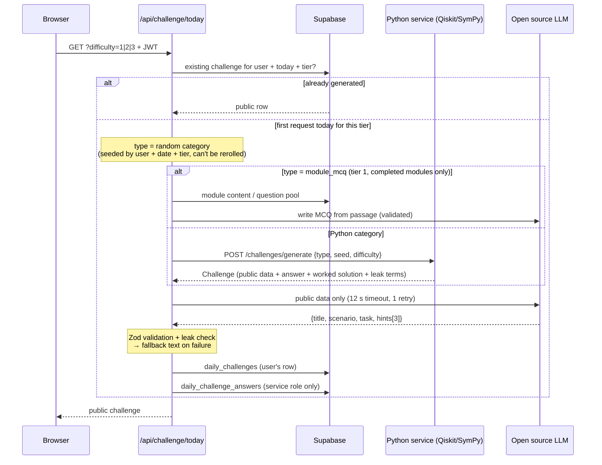

# Daily Challenge Starter Code Documentation & Handover

**Project:** Crack the Channel
**Component:** Daily Challenge feature
**Status:** The Python Microservice starter code is implemented and tested (37 passing tests). The TypeScript server code type-checks but **has not been run against live services** and doesn't have a frontend yet.

---

## Contents

1. [Purpose and scope](#1-purpose-and-scope)
2. [How it works](#2-how-it-works)
3. [Design decisions](#3-design-decisions)
4. [Challenge categories](#4-challenge-categories)
5. [File reference](#5-file-reference)
6. [Data model](#6-data-model)
7. [Configuration and running locally](#7-configuration-and-running-locally)
8. [Adding a new challenge type](#8-adding-a-new-challenge-type)
9. [Constraints and assumptions](#9-constraints-and-assumptions)
10. [Known limitations and risks](#10-known-limitations-and-risks)
11. [Whats not covered](#11-whats-not-covered)
12. [Remaining work](#12-remaining-work)
13. [Hosting notes](#13-hosting-notes)

---

## 1. Purpose and scope

The Daily Challenge gives each user a learning task each day: one per difficulty tier (up to three), with the category chosen at random. It is designed to:

- reinforce learning through practice,
- drive user retention (streaks, XP),
- demonstrate an open source LLM integration that is **safe for beginners**, meaning it never provides incorrect answers as fact

**In scope for this starter code:** challenge generation, answer computation, grading, mistake detection, LLM written challenge text and feedback, module multiple choice questions, database schema, XP/streak logic

**Out of scope for this starter code:** all frontend UI, the "Ask the Tutor" agent, admin tooling, deployment configuration. See [Section 11](#11-whats-not-covered).

---

## 2. How it works

### Core principle: code decides, the LLM writes

Every correct answer is **computed and graded by Python**. The open source LLM only writes text: the challenge scenario, hints and feedback. It never computes, verifies or grades tasks.

### Challenge generation flow



### Submission flow

```mermaid
sequenceDiagram
    participant User as Browser
    participant Next as /api/challenge/submit
    participant DB as Supabase
    participant Py as Python service
    participant LLM as Open source LLM

    User->>Next: {challengeId, submission, hintsUsed} + JWT
    Next->>DB: verify challenge belongs to user, attempts < 3
    Next->>DB: load answer (service role)
    Next->>Py: POST /challenges/grade {type, answer, submission}
    Py-->>Next: {correct, mistake_tag, explanation}
    Note over Next: module_mcq is graded directly in Next.js
    Next->>LLM: rephrase explanation (no new facts)
    LLM-->>Next: feedback (fallback: grader's explanation)
    Next->>DB: insert attempt; if correct → record_daily_solve (XP, streak)
    Next-->>User: correct, feedback, attemptsLeft, worked solution (if solved or out of attempts)
```
Diagrams made with Mermaid
---

## 3. Design decisions

Each decision is listed with a rationale so and whether it would be safe/easy to alter and can be mapped to ADRs

| # | Decision | Rationale | Safe to change? |
|---|---|---|---|
| D1 | **The LLM never computes or grades answers.** Python code generates and grades everything. | Small open source models make complex math errors, and beginners won't always be ablbe to detect them. | Yes, but only if a proprietary LLM was used in place of open source |
| D2 | **Generation is a fixed workflow, not an autonomous agent.** | Small models aren't very reliable for open ended tool loops. A fixed pipeline makes everything predictable and testable. The real agent use case will be used for the tutor. | Only for the tutor. |
| D3 | **Challenges are generated on demand, per user** (first request for a tier each day), then stored. | No scheduled job or approval step to build for the MVP. The seeded category means refreshing won't reroll so user's won't be able to try for a different task. | Yes, a shared mode can be introduced by seeding on date and tier. |
| D4 | **Three difficulty tiers per day, same topic.** | Allows both beginners and confident users to practice and gain XP. Costs 3 LLM calls a day per user. | Yes. |
| D5 | **Random category** from the available categories. | Matches the original design choice for the Challenges. | Yes: `PYTHON_TYPES` in `web/lib/server.ts`. |
| D6 | **Module MCQs are a random category (`module_mcq`) at tier 1**, drawn only from the user's completed modules. | Tier 1 only, since recall questions don't require as much difficulty as a worked answer. | Yes. |
| D7 | **Mistake tags.** Graders return a mistake tag and code written explanation. | Lets feedback be precise without trusting the LLM to gauge errors. Also useful usability testing. | Add tags freely. |
| D8 | **Distractors come from common mistakes** | Wrong options map to common misconceptions, so feedback targets them. | Yes. |
| D9 | **Answers stored in a separate table with RLS enabled and no policies.** | Only the service role can read answers so that they are never accessible client side. | No. |
| D10 | **Leak checks** rejects LLM outputs that contain any answer string. | Prevents the LLM from giving away an answer in hints or feedback. | Extend, don't remove. |
| D11 | **Deterministic fallbacks** for every LLM job. | The feature keeps working if the LLM is down or keeps producing invalid output. | No. |
| D12 | **Problems built backwards from known results** (gate identities, curated amplitude sets). | Guarantees a known correct answer and hand calculated numbers. | Extend the lists. |
| D13 | **Restricted gate set** (H, X, Z, CNOT, plus S in simplification). | Keeps amplitudes in the {0, ±1, ±1/√2, ±1/2} range, so beginners can compute by hand. | Only with a plan for "messy" numbers. |
| D14 | **Exact maths with SymPy. Answers accepted up to global phase** (±1). | `√2/2` and `1/√2` are both accepted, −\|ψ⟩ is physically the same state. | No. |
| D15 | **Safe maths parser**; `sympify()` is never used on user input. | `sympify` uses `eval`. The parser whitelists tokens, blocks exponents (DoS) and empties builtins. | Only to tighten. |
| D16 | **User circuits are whitelisted tokens** (`"h 0"`, `"cx 0 1"`), never raw QASM. | Minimises potential attack surface, simplifies validation, matches a drag and drop builder. | No. |
| D17 | **LLM accessed via an OpenAI compatible API.** | The same code works with Ollama (dev), vLLM (self-hosted) or a hosted open weight provider to give the team multiple options to work with to find best fit. Switching will be as simple as an env var change. | Yes. |
| D18 | **Python service is stateless** (no database, no users). Callable only with an internal API key. | Keeps the service simple, testable and portable. | No. |
| D19 | **Maximum 3 attempts per challenge**; worked solution revealed only when solved or user is out of attempts. | Discourages guessing. | Yes: `MAX_ATTEMPTS`. |
| D20 | **XP = max(10, difficulty × 50 − hints × 10 − (attempt − 1) × 15)**. Streak counts once per day. Completing extra tiers add XP only. | Rewards difficulty, penalises hints and guessing, but never penalises trying completely. | Yes: SQL function. |
| D21 | **Notation matchess learning modules**: 1/√2 (not √2/2), round bracket matrices, Qiskit qubit ordering (qubit 0 = rightmost). | Consistency with module content to reduce confusion. | Only if module content is altered. |

---

## 4. Challenge categories

All categories implement the same API routing (see `base.py`). Seeds are derived from `date:type:difficulty`, so a challenge can be regenerated if need be.

### 4.1 How a category is chosen (`web/lib/server.ts`, `app/api/challenge/today/route.ts`)

When a user opens the Daily Challenge and chooses a tier, the category is randomly selected:

| Category | Eligible tiers |
|---|---|
| `bb84_eve`, `sifting`, `state_evolution`, `normalisation`, `gate_simplification` | 1, 2, 3 |
| `module_mcq` | 1 only, and only if the user has completed a module with content or fallback questions (otherwise another category is chosen) |

The pick is seeded by `user:date:tier`, so it is random across users and days but fixed for a given user, day and tier. Each user can complete up to three tiers per day but only the first completed tier attributes to the user's daily streak.

### 4.2 Category details

**`bb84_eve`**: eavesdropping (`challenges/bb84.py`)

| Tier | Task | `input_kind` | Submission shape |
|---|---|---|---|
| 1 | Compute QBER from the sifted table; decide whether to abort (threshold 11%) | `decision` | `{abort: bool, qber_pct?: number}` |
| 2 | Estimate Eve's intercept rate from a given QBER (≈ 4 × QBER) | `multiple_choice` | `{option_id}` |
| 3 | Play as Eve: pick the highest intercept rate that stays under a randomised threshold | `number` | `{rate_pct: number}` |

Mistake tags: `missed_eve`, `false_alarm`, `qber_miscount`, `qber_is_rate`, `half_not_quarter`, `double_counted`, `too_greedy`, `too_cautious`.

**`sifting`**: key sifting and decryption (`challenges/bb84.py`)

| Tier | Task | `input_kind` | Submission shape |
|---|---|---|---|
| 1 | Sift the key (10 rounds) | `bits` | `{bits: "0101"}` |
| 2 | Sift (20 rounds), then XOR-decrypt 6 ciphertext bits | `bits` | `{bits}` |
| 3 | Sift (48 rounds), decrypt 15 bits, decode a 3-letter word (5 bits per letter, A = 00000) | `text` | `{text: "KEY"}` |

Mistake tags: `kept_all`, `used_mismatched`, `wrong_length`, `not_decrypted`, `used_unsifted_key`, `bit_error`, `wrong_word`.

**`state_evolution`**: apply gates to a state (`challenges/state_evolution.py`)

| Tier | Task | `input_kind` | Submission shape |
|---|---|---|---|
| 1 | One gate on one qubit; start state \|0⟩, \|1⟩, \|+⟩ or \|−⟩; reference matrix shown | `multiple_choice` | `{option_id}` |
| 2 | One gate on a 2-qubit basis state; expanded 4×4 matrix shown | `multiple_choice` | `{option_id}` |
| 3 | Two gates (may include CNOT) on a 2-qubit state; no matrix shown | `amplitudes` | `{amplitudes: ["1/sqrt(2)", "0", …]}` in basis order 00, 01, 10, 11 |

Mistake tags: `wrong_ordering`, `forgot_normalisation`, `sign_error`, `wrong_start`, `wrong_gate`, `gate_not_applied`, `unparseable`.

**`normalisation`**: normalisation and the Born rule (`challenges/normalisation.py`)

| Tier | Task | `input_kind` | Submission shape |
|---|---|---|---|
| 1 | Probability of a given outcome for a normalised state | `multiple_choice` | `{option_id}` |
| 2 | Find N for real amplitudes | `text` | `{text: "1/sqrt(3)"}` |
| 3 | Find N for complex amplitudes | `text` | `{text}` |

Mistake tags: `forgot_sqrt`, `summed_amplitudes`, `no_reciprocal`, `squared_i_negative`, `forgot_square`, `assumed_equal`, `forgot_normalise`, `unparseable`. When two mistakes would produce the same wrong value, only the first is kept, so feedback never names the wrong misconception.

**`gate_simplification`** (`challenges/gate_simplification.py`)

| Tier | Task | `input_kind` | Submission shape |
|---|---|---|---|
| 1 | "HXH equals which single gate?" | `multiple_choice` | `{option_id}` |
| 2 | Simplify a 1-qubit circuit built from 3 chained identities | `circuit` | `{circuit: ["z 0"]}` (empty list = identity) |
| 3 | Simplify a 2-qubit circuit including CNOT identities | `circuit` | `{circuit}` |

Mistake tags: `wrong_gate`, `not_equivalent`, `not_simplest`, `invalid_circuit`. Grading uses `Operator.equiv` (ignores global phase), so any equivalent circuit with at most the reference gate count is accepted.

**`module_mcq`**: multiple choice on learning content (`web/lib/moduleMcq.ts`, `web/lib/prompts.ts`)

Tier 1 only. The LLM writes one MCQ from a chunk of one of the user's completed modules. It is validated by (a) the supporting quote appearing verbatim in the passage and (b) a second, independent LLM call answering the question the same way. On failure, a question from `question_pool` is used. Options are shuffled with a seeded shuffle, and grading happens in Next.js (no Python needed). Mistake tag: `wrong_option`.

---
## File Reference

### 5.1 Python service (`qiskit_service/`)

| File | What it does | Why it exists / notes |
|---|---|---|
| `main.py` | FastAPI app with four endpoints: `GET /health` (unauthenticated), `GET /challenges/types`, `POST /challenges/generate`, `POST /challenges/grade`. All except `/health` require the `x-api-key` header (constant time comparison). | The only interface to the maths engine. `/generate` returns answers, so it can never be callable via client side. |
| `challenges/__init__.py` | Imports every category module so they register themselves. | New categories must be imported here or they won't exist. |
| `challenges/base.py` | Shared contract: `Challenge` and `GradeResult` dataclasses, `ChallengeType` base class, `REGISTRY` and `@register`, `rng_for()` (seeded RNG per attempt), `make_options()` (shuffles MC options and records which tag each distractor represents), `grade_mc()`, `tidy_latex()`. | Keeps every category consistent, so the web layer handles all types identically. |
| `challenges/safe_math.py` | `parse_user_number()` safely handles free text maths answers (`1/sqrt(3)`, `√2/2`, `2i`). `equal()` and `equal_up_to_sign()` do exact comparison. | For security purposes, tested against injection and DoS inputs. |
| `challenges/bb84.py` | `run_bb84()` runs BB84 rounds on Aer (one 1 qubit circuit per round, intercept resend as a mid circuit measurement). Also contains `sift()`, `qber()`, `bb84_eve` and `sifting` categories. | `run_bb84()` is also intended for the tutor agent's tools. |
| `challenges/state_evolution.py` | Builds small circuits, evolves basis states with `Statevector`, converts amplitudes to exact symbols, generates mistake based distractors and LaTeX worked solutions. | Matches the module content's matrix x vector explanations. |
| `challenges/normalisation.py` | Curated amplitude sets. Computes N, probabilities and mistake values with SymPy. | Curated sets keep answers tidy and hand calculable (1/5, 1/3, 1/√2, 1/2, 1/13). |
| `challenges/gate_simplification.py` | Identity lists, `build()`, `shortest_equivalent()`, generation and grading via `Operator.equiv`. | Building from identities guarantees a known answer. |
| `test_challenges.py` | pytest: every category × tier × 15 seeds generates, serialises to JSON, accepts its own correct answer, and exposes no answer fields publicly. Also checks determinism, mistake tagging and the safe-maths accept/reject lists. | New categories are covered automatically once registered. Run before every merge. |
| `requirements.txt` | fastapi, uvicorn, qiskit, qiskit-aer, sympy, numpy, pytest. | Pin exact versions before production. |

### 5.2 Web server code (`web/`)

| File | What it does | Why it exists / notes |
|---|---|---|
| `lib/llm.ts` | OpenAI SDK client pointed at `LLM_BASE_URL`. `llmJson()` requests JSON (structured output schema or JSON mode), validates with Zod, runs an optional extra `check`, and retries with the rejection reason, with a per attempt timeout. `leaks()` does a case and space insensitive answer leak check. | One place for all LLM calls. Requires **Zod v4** (`z.toJSONSchema`). |
| `lib/prompts.ts` | The three LLM jobs: `writeChallengeText()` (public data only, leak checked 12 sec timeout, 1 retry, since the user is waiting), `writeFeedback()` (rephrases the grader's explanation, falls back to it if unavailable), `writeModuleMcq()` (verbatim quote and self consistency checks). Also `FALLBACK_TEXT` per category. | System prompts forbid computing or restating numbers. Edit all prompts here. |
| `lib/server.ts` | Supabase admin (service role), `qiskit()` HTTP helper, `melbourneDate()` (today in Melbourne), `seedFrom()` (FNV 1a hash), `seededRandom()`, `PYTHON_TYPES`, `MODULE_MCQ`, `MAX_ATTEMPTS`. | Server only! **Never import into client components** (contains the service role key). |
| `app/api/challenge/today/route.ts` | `GET ?difficulty=1–3`. Returns the user's challenge for that day at that tier, generating it on first request. Picks a seeded random category, builds it (Python service or `moduleMcq.ts`), writes text via LLM (with fallback), and stores public and private rows in DB. Safe against double requests (first insert wins). | Implements D3-D6. **UI will need a loading state**, since first generation may take a few seconds. |
| `app/api/challenge/submit/route.ts` | Validates the JWT and submission shape (Zod, size limits), checks the challenge belongs to the user and how many attempts remain for user, loads answer, grades (Python service or `module_mcq`), gets LLM feedback, records attempt, updates XP and streak, returns feedback and worked solution when applicable. If grading is unavailable, no attempt is used up. | All grading is server side. |
| `lib/moduleMcq.ts` | `buildModuleMcq()` returns a `module_mcq` challenge in the same shape as the Python service (or `null` if the user has no eligible modules). `gradeModuleMcq()` grades it. | Keeps every category going through the same storage and submit flow. |
| `tsconfig.json` | Minimal config used to type check server code; maps `@/*` to the web root. | Merge into Next.js project's config. |

### 5.3 Database (`supabase/schema.sql`)

Creates tables, enables RLS, adds policies and the `record_daily_solve` function. See [Section 6](#6-data-model).

---

## 6. Data model

| Table | Contents | Client access (RLS) |
|---|---|---|
| `daily_challenges` | One row per user, day and tier: type, `input_kind`, `prompt_data`, options, LLM text, hints | Users read their own rows |
| `daily_challenge_answers` | Answer, worked solution, leak terms, seed | **None** (service role only) |
| `challenge_attempts` | Per attempt submission, correctness, mistake tag, hints used | Users read their own rows |
| `module_chunks` | Learning content split into chunks | Authenticated users read |
| `question_pool` | Human reviewed fallback MCQs | **None** | <-- will need to be implemented

`record_daily_solve(p_user, p_date, p_difficulty, p_hints, p_attempt)` is `security definer` only service role can call.

---

## 7. Configuration and running locally

### Environment variables

| Variable | Used by | Purpose |
|---|---|---|
| `INTERNAL_API_KEY` | Python + web | Shared secret between Next.js and the Python service |
| `QISKIT_SERVICE_URL` | web | Base URL of the Python service |
| `LLM_BASE_URL` | web | OpenAI compatible endpoint |
| `LLM_API_KEY` | web | Provider key |
| `LLM_MODEL` | web | Model name |
| `LLM_JSON_MODE` | web | `json_schema` (default) or `json_object` if the provider lacks structured outputs |

### Running the Python service

```bash
cd qiskit_service
pip install -r requirements.txt
pytest -q                                   # expect 37 passed - created to ensure code interpretation works as intended
INTERNAL_API_KEY=dev uvicorn main:app --reload
```

### Web dependencies

```bash
npm i openai zod@^4 @supabase/supabase-js
```
---

## 8. Adding a new challenge type

1. Create `qiskit_service/challenges/<name>.py` with a class decorated `@register` that sets `name` and `mistakes` (including `correct` and `other`) and implements `generate()`, `grade()` and `solution_submission()`.
2. Populate `leak_terms` with every string that would give away the answer.
3. Import the module in `challenges/__init__.py`. The tests should pick it up automatically.
4. Run `pytest -q`.
5. Add a `FALLBACK_TEXT` entry in `web/lib/prompts.ts`.
6. Add it to `PYTHON_TYPES` in `web/lib/server.ts` and, if it uses a new submission shape, extend the Zod union in `submit/route.ts`.
7. Build the frontend input component for its `input_kind`.

**Rules for new types:** answers must be computed via code. Numbers should be calculable by hand for beginners. Distractors should map to named misconceptions.

---

## 9. Constraints and assumptions

- **Open source LLM required** by client brief. Proprietary APIs are too costly and out of scope.
- **Audience:** complete beginners (first year cyber security students) with no quantum background. All text must be layman, and all numbers hand calculable.
- **Architecture:** Supabase for auth + Postgres only. Python/Qiskit as a separate Dockerised FastAPI service. LLM and agent logic in Next.js API routes.
- **Timezone:** all "days" are Australia/Melbourne set.
- **Security posture:** answers and grading never meets client side. Untrusted inputs are whitelisted and size limited.
- **Hosting:** service must be reachable from the web host over HTTPS. 

---

## 10. Known limitations and risks

| Area | Limitation | Impact / mitigation |
|---|---|---|
| On demand generation | The first request for a tier each day waits for the Python service and  LLM (typically a few seconds; LLM capped at 12 s + 1 retry, then fallback text). | Will need to show a loading state. If the Python service is down, the route should return an error and handle gracefully. |
| BB84 model | No channel noise, any error will be attributed to Eve. The 11% threshold is a simplification. | Acceptable for beginners, the modules should mention that real QKD will also involve noise. |
| Eve tier 2 | Estimates from ~60 sifted bits can differ noticeably from Eve's true rate. | Graded against the method (4 × QBER), not the hidden rate. The worked solution explains the gap. Increase rounds if it confuses testers. |
| Gate "optimal" | `shortest_equivalent()` only searches up to 2 gates, so longer references may not be truly minimal. | A user who beats the reference is still marked correct. |
| Leak check | String matching only, a paraphrasing could pass testing unnoticed. | Low risk given strict prompting, but generated hints should be reviewed during testing. |
| Hints | All hints are in a public row, and `hintsUsed` is reported by client side, so the XP penalty is honour system. | Move hints to a server endpoint that records each reveal if there is concern of tampering. |
| Concurrent submits | Two simultaneous submissions could get the same `attempt_no`; the unique constraint makes one fail. | Disable the submit button while submission is pending, handle the constraint error or move attempt logic into a SQL function. |
| Module MCQ check | The self consistency check uses the same model, so errors can be correlated. | Keep verbatim quote check, spot check review questions during testing. |
| LLM structured output | Support for `json_schema` varies by model. | Set `LLM_JSON_MODE=json_object`; Zod validation still applies. |
| No shared challenge | Users get different challenges, so there's no shared "today's challenge" for result sharing. | A shared mode could be added later by seeding on date and tier only if wanted. |
| Integration testing | TypeScript has only been type checked, not run against Supabase, the LLM or the Python service. | First priority should be E2E testing (see backlog). |
| Unreviewed text | LLM written challenge text reaches users without human intervention or screening. | Acceptable because the LLM never writes answers and text is leak checked, but we should still review hints during usability testing. |

---

## 11. What code does not cover

- **All frontend UI**: challenge page, tier picker, hint reveal, input components per `input_kind` (multiple choice, bit entry, maths text input, amplitude dropdowns, circuit builder, abort decision, rate slider), LaTeX rendering, results/streak display, sharing.
- **Review answer grading**: no endpoint to submit an answer to a review MCQ.
- **Admin tooling**: no admin page to view user analytics or mistake tag frequencies.
- **The "Ask the Tutor" agent** (tool calling chat).
- **Boss / chained challenges**: a chained challenge with multiple steps that could be offered once a week to get more XP than normal
- **Leaderboards** and friend features.
- **Deployment**: no Dockerfile changes, `docker-compose.yml` or CI/CD.
- **Observability**: no structured logging, LLM failure rate metrics or alerting.
- **Content**: module chunks and `question_pool` entries must be written and loaded.
- **Accessibility and localisation** of challenge UI and LaTeX.
- **Formal LLM evaluation** (open source model slection).

---

## 12. Remaining work

**P0: needed for final MVP**
1. E2E testing: run the Python service locally, call `/api/challenge/today` for each tier, submit correct and incorrect answers.
2. Frontend challenge pages and access: tier picker, loading state, input components for every `input_kind`, KaTeX rendering, hint reveal, feedback and worked solution.
3. Deployment of the Python service (Render) and set Vercel function region to Sydney (`syd1`).
4. Optional for the MVP: load module chunks and a small `question_pool` per module to activate `module_mcq`. The Daily Challenge will work without it

**P1: quality and robustness**
5. Handle concurrent submissions (see Section 10).
6. Server tracked hint reveals instead of client side.
7. Deployment: Dockerfile update, Compose file, CI/CD, uptime monitoring.
8. Logging LLM failures, fallback usage and mistake tag frequencies.
9. Pin dependency versions.

**P2: extensions**
10. "Ask the Tutor" agent with tools (`run_bb84`, module retrieval, user progress).
11. Boss challenge (Eg: chain state evolution -> normalisation -> basis probabilities -> BB84 implication).
12.  XP and/or streak leaderboards

---

## 13. Hosting notes

**Render**: Simple and portable, however lower tiers sleep when idle, so the first request after inactivity will be slow. This matters because challenges are generated and graded while the user waits. Mitigate with an always on instance, a keep warm ping, and implement a "checking your answer…" UI state.
